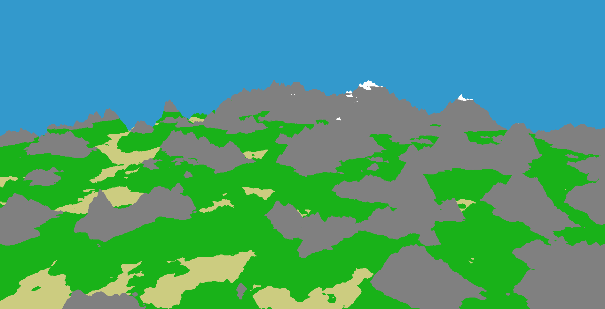
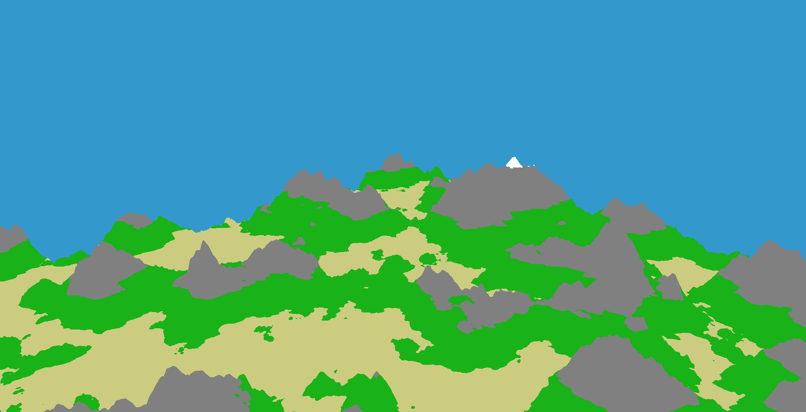
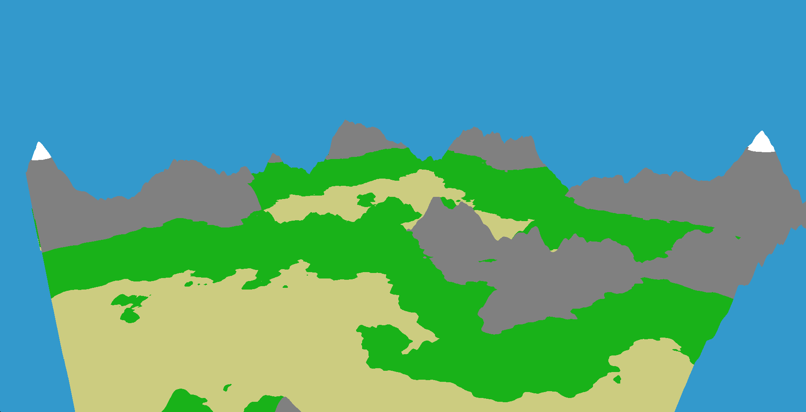

### Terrain generator and visualizer
*Project for university*

Wraps user defined function into a C++ code and saves to a file, which then gets loaded using ```dlopen()```. It then computes height values for all vertices of user defined plane and renders terrain.
The plane's dimensions can be changed on the fly. As well as function used for generation itself.

#### Examples
---

**4Kx4K plane**


**2Kx2K plane**


**1Kx1K plane**


#### Dependencies
---
- GLFW for window management
- GL3W for OpenGL function loading
- OpenGL for rendering
- GLM for math
- ImGui for GUI

#### Run
---
```./tgv```

#### Build
---
*Currently works only on Linux.*
```mkdir functions```
```make```
```./tgv```
