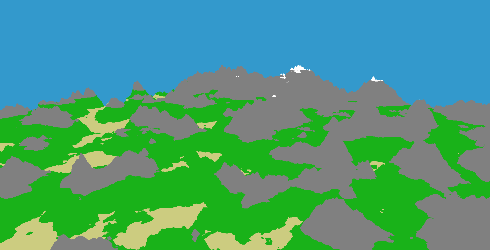
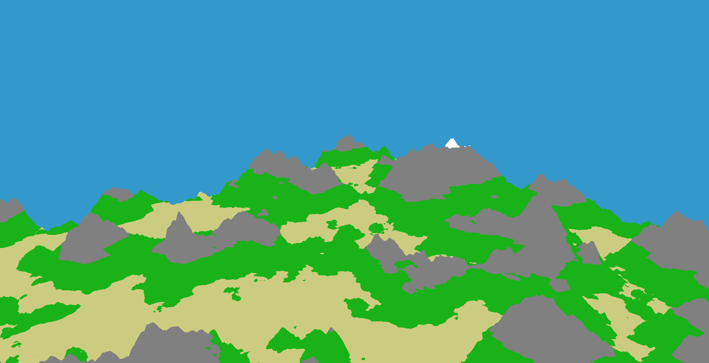
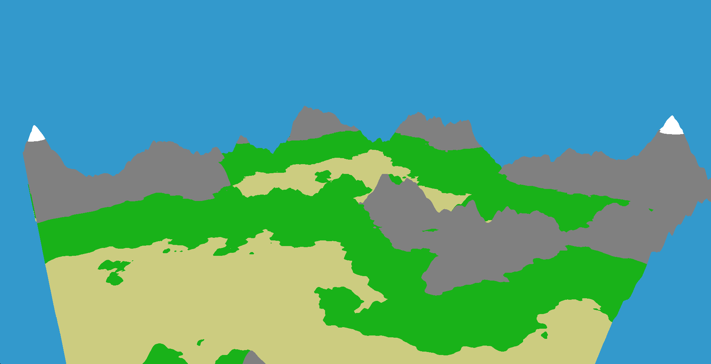

### Terrain generator and visualizer
*Project for university*

Wraps UDF into a glsl file, which gets used for height map generation.

*Works only on linux.*<br/>
#### Examples
---
*4Kx4K plane*
<div align="left">
    
</div>

*2Kx2K plane*
<div align="left">
    
</div>

*1Kx1K plane*
<div align="left">
    
</div>


#### Dependencies
---
- GLFW for window management
- GL3W for OpenGL function loading
- OpenGL for rendering
- GLM for math
- ImGui for GUI

#### Run
---
```./build/tgv```

#### Build
---
```cmake --build build```<br/>
```./build/tgv```
